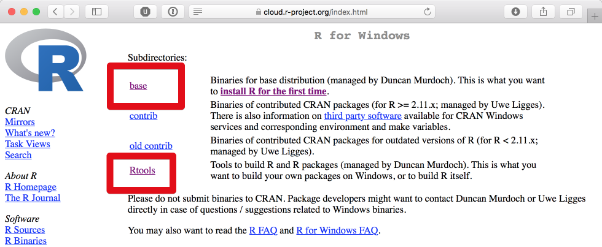
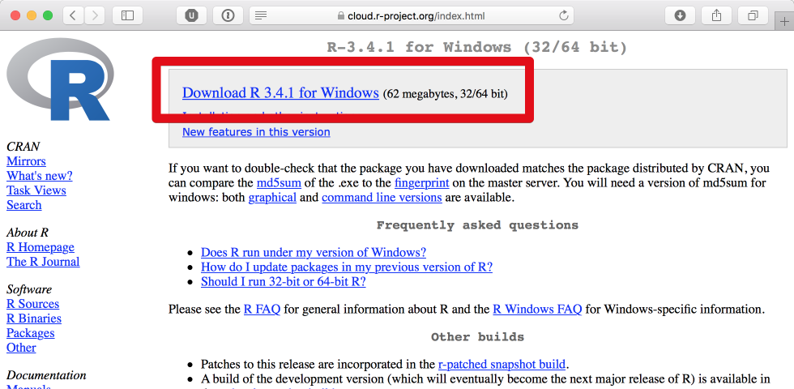
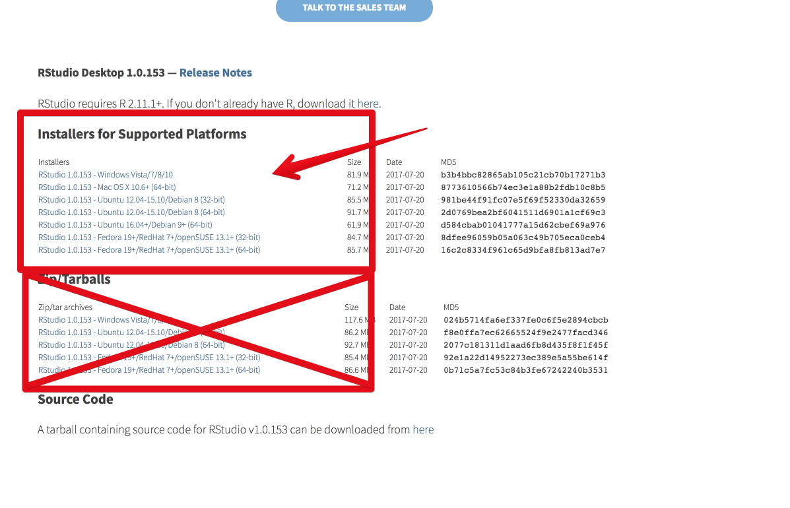

# Installation

Hier eine kurze Anleitung um R und RStudio zu installieren.  
Kurz zum Kontext: R ist eine Programmiersprache, das heißt "R installieren" ist anders als "Spotify installieren".  

Ihr installiert zunächst R, und bekommt dann auf dem Desktop Verknüpfungen angeboten für "R GUI" (o.Ä.) — Dabei handelt es sich um "nackte" Konsolenprogramme.  
Damit *könntet* ihr R benutzen, aber es macht beim besten Willen keinen Spaß.  
**Deshalb** installiert ihr **RStudio** — Ein Programm (wie Spotify, nur ganz anders!), mit dem ihr R komfortabler benutzen könnt.

## R installieren

R bekommt ihr von der offiziellen seite, hier: <https://cloud.r-project.org/>

```{r, echo=FALSE}
knitr::include_graphics("images/install_R.png")
```

Ja, die Seite sieht nach heutigen Standards furchtbar alt aus, aber die gibt's nunmal auch schon ewig und sie hat den Anspruch möglichst spartanisch zu sein um auch auf jedem noch so ranzigen Computer ordentlich dargstellt und ggf. von Scripten ausgelesen zu werden. 

### Windows

Klickt auf der oben genannte Seite auf `Download R for Windows`. Vollkommen unerwartet.

```{r, echo=FALSE}

```

Hier benötigt ihr `base` (der R installer):

```{r, echo=FALSE}

```

…und sicherheitshalber auch `Rtools` (fragt nicht. Vorerst installiert ihr es einfach).  

```{r, echo=FALSE}
knitr::include_graphics("images/install_R_windows_3.png")
```

Da ich akut keinen Windows-Computer zur Hand habe, gehe ich einfach davon aus, dass ihr das Prinzip "`.exe`-Datei doppelklicken und alles brav mit `ja` oder `OK` bestätigen" beherrscht. Schafft ihr bei Spotify ja auch.   

Das war die R-Installation!  
Und _jetzt_ installiert ihr [RStudio](#rstudio-install)

### Mac OS X (macOS) {#mac}

Klickt auf der oben genannte Seite auf `Download R for (Mac) OS X`. Auch das, vollkommen unerwartet.

```{r, echo=FALSE}
knitr::include_graphics("images/install_R_mac.png")
```

- Wenn euer Betriebssystem auf dem aktuellen Stand ist, benutzt die aktuelle Version des R-installers.  
- Wenn ihr aus unerfindlichen Gründen noch eine sehr alte OS X version laufen habt:
    a) Möge die Deität eurer Wahl euch beistehen
    b) Aktualisiert euer Betriebssystem, oder wenn das nicht möglich ist...
    c) ...müsst ihr vermutlich den Installer mit `snowleopard` im Namen  benutzen 
- Wenn ihr nicht wisst, welche OS X Version ihr benutzt: Versucht's erstmal mit dem aktuellen Installer, wenn das nicht funktioniert, versucht den älteren. Ansonsten: Googlet.

Ansonsten braucht ihr nichts runterzuladen. Den Installer (die `.pkg`-Datei) einfach doppelklicken und alles brav bejahen.  
Fertig.

### Linux

Wenn ihr Linux benutzt, solltet ihr unabhängig von der Geschmacksrichtung auch wissen, wie man da Software installiert.  

Es gibt diese Info-Seite für Ubuntu: <https://cloud.r-project.org/bin/linux/ubuntu/README.html>.  
Wenn ihr nicht wisst, was `https://<my.favorite.cran.mirror>/bin/linux/ubuntu` sein soll, dann setzt für `<my.favorite.cran.mirror>` am besten einfach `cloud.r-project.org` ein. Falls ihr dann noch Probleme haben solltet, benutzt den HTTP statt den HTTPS mirror, sprich die Zeilen unter "Installation" im verlinkten Dokument würden dann so aussehen:

- `deb https://cloud.r-project.org/bin/linux/ubuntu xenial/`
- Oder: `deb http://cloud.r-project.org/bin/linux/ubuntu xenial/`

Zusätzlich solltet ihr vermutlich einige Systempakete (also außerhalb R) installieren, für den Fall der Fälle.

Für Ubuntu im Speziellen: 

```bash
sudo apt install libcurl4-openssl-dev curl git libxml2-dev libcairo2-dev
```

Damit installiert ihr ein paar Pakete, die ihr für manche R-packages als Depdendency benötigt.  
Die Liste ist nicht vollständig für _alle_ möglichen R packages, aber zumindest alle, die wir im Laufe dieser Intro benutzen oder benutzen *könnten* sollten damit abgedeckt sein.

## RStudio installieren {#rstudio-install}

RStudio bekommt ihr hier: <https://www.rstudio.com/products/rstudio/download/#download>

```{r, echo=FALSE}

```

Hier dasselbe Spiel:  
Installationsdatei für euer Betriebssystem runterladen und installieren traue ich euch zu.  
Enttäuscht mich nicht.

Nach der Installation solltet ihr jedenfalls folgendes Symbol entweder auf eurem Desktop oder in eurem Programmordner finden:

```{r, echo=FALSE, fig.align='center'}

```

Das wollt ihr anklicken, dann sollte sich RStudio öffnen und ihr habt erfolgreich R und RStudio installiert.  
Gratuliere.

Falls ihr Windows 10 benutzt und sich keine Desktopverknüfung erstellt habt, wollt ihr eure Suchfunktion benutzen und "RStudio" suchen. Vollkommen unerwartet, ich weiß.  

## RStudio benutzen

Das ist keine Anleitung, das ist eine Aufforderung.  

Ihr benutzt *ausschließlich* RStudio. 
Alle anderen Desktopverknüpfungen die im Laufe der Installationen erschienen sein sollten könnt ihr getrost löschen, die braucht ihr nicht.  
Dazu gehören solche Dinge wie "R Console" oder auch "R GUI" oder ähnliches. Das sind die Verknüpfungen für das reine R, aber wir wollen R ja durch RStudio benutzen.  
Trust me, it's better that way.  

In RStudio könnt ihr jetzt vermutlich noch nicht viel machen, außer in der Konsole aus Spaß "`print('Wurstwasser')`" eingeben und Enter drücken.
