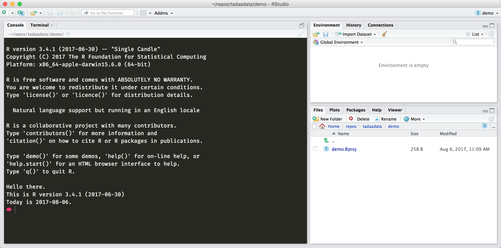
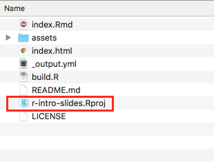
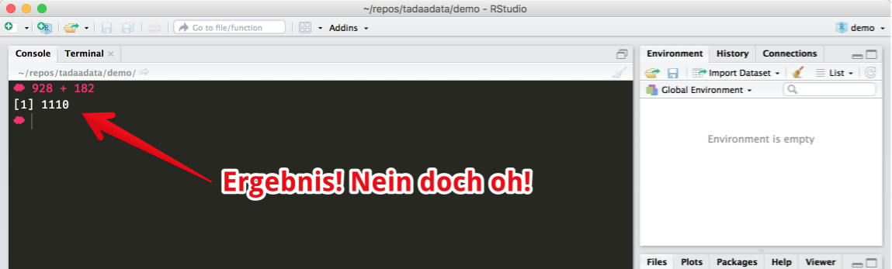
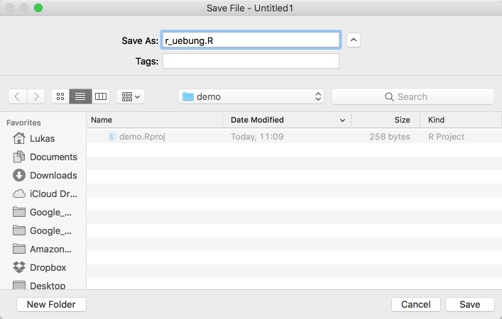

# Orientierung

```{r setup_orientierung, include=FALSE}
library(knitr)
knitr::opts_chunk$set(echo=F,
                      out.width="90%")
```


Wenn ihr vorher noch nie eine Programmiersprache benutzt habt… ist das auch eigentlich gar nicht so schlimm, denn R verhält sich sowieso für den Einstieg etwas anders.  

"Programmiersprache" klingt so abschreckend, weil es nach kompliziertem Informatikkram klingt, aber wenn ihr es in eurer Schulzeit geschafft habt einen Taschenrechner zu bedienen, dann bekommt ihr auch den Einstieg in R hin.  
Was der Begriff "Programmiersprache" für uns heißt ist recht simpel:  
R folgt Anweisungen. Anweisungen, die wir entweder in die Konsole (in RStudio das Fenster unten links) schreiben können, und dann mit der Entertaste bestätigt werden. R guckt dann, ob es weiß wovon ihr redet, und rödelt dann los — und wenn es weiß was es mit eurem Befehl anfangen soll, gibt es euch auch direkt eine Antwort.  

Gute Praxis^[Wenn wir von "Guter Praxis" reden, dann meint das in der Regel bestimmte Gewohnheiten, die wir euch empfehlen, weil sie euer Leben langfristig einfacher machen. Ihr müsst nicht immer sofort verstehen wieso wir euch irgendetwas empfehlen, aber seit euch sicher, dass da mehrere Jahre Erfahrung hinter stecken.] ist es übrigens, ein *Script* zu erstellen, das Scriptfenster ist dann in RStudio oben links. Dort könnt ihr einen Befehl pro Zeile schreiben und als Datei abspeichern, so müsst ihr euch bei eurer Arbeit nicht jeden Befehl einzeln merken, sondern könnt einfach das Script wieder neu ausführen und eure Ergebnisse tauchen alle wieder auf. 

## RStudio

Wenn ihr RStudio öffnet, seht ihr vermutlich folgendes:

```{r, fig.cap="Ein frisches RStudio Fenster"}

```

Auf der rechten Seite habr ihr eine Übersicht eurer Dateien und angelegten Variablen, sowie der Hilfe und diversem anderem Krams, der uns zuerst noch nicht interessiert.  
Das große Fenster zur linken Seite ist die Konsole, mit der beschäftigen wir uns zuerst.  

Bevor wir hier aber irgendwas machen, schaffen wir erstmal ein bisschen Struktur und erstellen ein neues Projekt.  
Ein Projekt ist einfach nur ein bestimmter Ordner, in dem ihr arbeiten könnt. Idealerweise ist es auch ein Ordner, den ihr auf eurem Computer einfach wiederfindet.

```{r, fig.cap="Ein neues RStudio Projekt erstellen"}
include_graphics("images/rstudio_new_project_0.png")
```

```{r}
include_graphics(c("images/rstudio_new_project_1.png",
                          "images/rstudio_new_project_2.png",
                          "images/rstudio_new_project_3.png"))
```

Am Ende solltet ihr euer erstes Projekt erstellt haben.  
Hier könnt ihr jetzt den Rest der Einführung über bleiben und Scripte erstellen und sowieso und überhaupt, und wenn ihr brav alles gespeichert habt, könnt ihr darauf auch in drei Wochen noch wieder zurückgreifen, indem ihr einfach das Projekt aus der entsprechenden Leiste in RStudio auswählt.

```{r fig.cap="RStudio merkt sich eure letzten paar Projekte"}
include_graphics("images/rstudio_projects.png")
```

Alternativ könnt ihr auch auf eurem Computer den Ordner mit dem Projekt öffnen^[Es bietet sich an, RStudio Projekte irgendwo zentral zu organisieren, oder sie zum Beispiel in einem Unterordner für euer Studiumszeug anzulegen. Bei mir war das z.B. sowas wie `Dokumente/Studium/Psychologie/Statistik/`], dort dann einfach die Datei mit dem RStudio-Logo und der `.Rproj`-Endung öffnen

```{r fig.cap="Ein RStudio Projektordner"}

```

Als nächstes können wir uns **Konsole** und **Text Editor** widmen: Ihr könnt in der Regel immer nur in einem der beiden Bereiche schreiben, und erkennt den aktiven Bereich am blinkenden Cursor (ein bisschen wie in Textprogrammen á la Word) — Konsole und Editor sind die wichtigsten Bereiche in RStudio, und dort wird auch der Großteil eurer Arbeit gemacht.

## Konsole

Jetzt habt ihr ein frisches Projekt und könnt loslegen.  
Als erstes müssen wir uns mit der Konsole (dem Teil unten links) vertraut machen.  
Hier könnt ihr Frage-Antwort-mäßig Befehle eingeben, mit Enter bestätigen, und erhaltet eine Antwort.  
Hier kommt die Taschenrechner-Analogie wieder — versucht mal folgendes:

```r
928 + 182
```

```{r, fig.cap="Oh Schreck, es funktioniert tatsächlich!"}

```

Die Mathe-Basics in R:  

- Addition: `+`
    - `52 + 365` --> 417
- Subtraktion: `-`
    - `2017 - 18` --> 1999
- Multiplikation: `*`
    - `4*21` --> 84
- Division: `/`
    - `936/12` --> 78
- Exponentiation: `^`
    - `2^10` --> 1024
- Klammern: `(`, `)`
    - `3 * (12 - 8) + 2^(5/2)`
    - Wie beim Taschenrechner: Lieber zwei mehr als nötig als eine zu wenig
    - …und ja, jede [offene Klammer](https://xkcd.com/859/) braucht eine geschlossen Klammer, sonst gibt's Fehler
- Das Dezimaltrennzeichen ist der Punkt `.`
    - 12,1 wird eingegeben als `12.1`
    - Die Konvention kommt aus dem englischsprachigen Raum, da sind Zahlen… anders

Ansonsten gibt es etliche weitere mathematischen Funktionen, und wir können das ganze beliebig komplex aussehen lassen:

```r
2 + sin((2*pi)/3) * exp(5)
```

Hier sehen wir mehrere neue Dinge:

Erstens: `pi` ist wirklich, naja, $\pi$. Das mit dem Kreis. Als Konstante schon in R vorgespeichert, weil ja kein Mensch $\pi$ auf der Tastatur findet[^pi].  
Zweitens: `sin()` und `exp()` sind **Funktionen**. Die sind ziemlich wichtig, aber denen wenden wir uns erst im nächsten Abschnitt zu.  
Was wir da geschrieben haben sieht übersetzt in Mathe übrigens so aus…

$$2 + \sin \left( \frac{2\pi}{3} \right) \cdot e^{5}$$

… und ergibt etwa 130,5. Aber darum geht's eigentlich gar nicht. 

### Gängige Probleme

Was den meisten Leuten während der R-Einführung passiert ist, dass sie einen Befehl in die Konsole eingeben und Enter drücken, aber der Befehl nicht richtig abgeschlossen (*korrekt terminiert*) wurde. Das passiert zum Beispiel, wenn ihr eine schließende Klammer vergesst, oder etwa ein `+` am Ende der Zeile habt. In diesen Fällen drückt ihr Enter und R nimmt euren Befehl entgegen, aber es merkt, dass da irgendwas fehlt und wartet auf den Rest des Befehls.  
Ihr erkennt das daran, dass das Symbol an der linken Seite eurer Konsole auf einmal ein Pfeil ist und auch wiederholtes Drücken der Entertaste nichts daran ändert.  
Ihr habt an dieser Stelle zwei Möglichkeiten:

- Drückt Escape (`esc`) um den Befehl abzubrechen und es nochmal zu versuchen
- Führt den Befehl korrekt zu Ende, sprich schließt ggf. offene Klammern etc.

## Text Editor

Alles was in der Konsole passiert ist schön und gut, aber es ist flüchtig. Stellt es euch vor wie eine Timeline auf Facebook, Twitter, Instagram oder was auch immer diese jungen Leute heutzutage benutzen.  
Sobald ihr mehr als vier oder fünf Befehle eingegeben habt, müsst ihr hochscrollen, um eure alten Ergebnisse wieder zu finden. Das ist vollkommen okay um mal schnell etwas auszuprobieren, aber eher unpraktisch für eure Arbeit, die in der Regel sowas wie Reproduzierbarkeit erfordert.

Dazu gibt es Scripte. Scripte sind im Grunde nur Textdateien, in die ihr R-Befehle eingebt.  
Schön brav einen Befehl pro Zeile, wie in der Konsole.  
Scripte könnt ihr speichern und an andere Leute verschicken oder hochladen oder euch ausdrucken und an die Backe tackern — der Kreativität sind keine Grenzen gesetzt!

Um euer erstes Script zu erstellen klickt ihr in RStudio oben links den Button, der nach neuer Datei aussieht:

```{r, fig.cap="Liebes Tagebuch: Heute habe ich einen Button geklickt. Es war sehr schön."}
include_graphics("images/text_editor_1.png")
```

Danach ploppt das Fenster oben links auf und begrüßt euch mit einem leeren Textfeld:

```{r fig.cap="Na, auch hier?"}
include_graphics("images/text_editor_2.png")
```

Im Moment heißt euer Script noch `Untitled1` — das heißt, euer Script hat noch keinen Namen und ist **noch nicht gespeichert**. Letzteres wollt ihr umgehend ändern, weil all eure schönen Befehle für die Katz sind, wenn ihr euren Kram nicht speichert.  
Ihr könnt zum speichern entweder den anachronistischen Diskettenbutton klicken und eurem Script einen schönen Namen geben, oder ihr drückt `STRG + S` oder auf dem Mac `cmd + S` — der wohl wichtigste Keyboard-Shortcut der Welt.

```{r fig.cap="Der \"Datei speichern…\"-Dialog"}

```

Gebt eurem Script einen aussagekräftigen Namen. Ihr wollt ja auch in zwei Wochen noch wissen, was ihr da gemacht habt.  
Außerdem solltet ihr darauf achten, am besten ausschließlich Zahlen und Buchstaben sowie `-` und `_` zu verwenden. Leerzeichen und Umlaute (äöü) sind zwar *in der Theorie* kein Problem, aber glaubt mir, sobald ihr euer Script an KommilitonInnen mit anderen Betriebssystemen verschickt, kann auch jedes noch so harmlos aussehende *Ü* auf einmal zu einer Reihe von kleinen Problemen führen, deren Ursache ihr erst nach Stundenlanger Probiererei (oder niemals) finden würdet.  

Etwas ähnliches gilt auch für den Text in eurem Script:  
Vermeidet nach Möglichkeit besondere Zeichen wie Emoji :upside_down_face: (auch wenn die theoretisch korrekt angezeigt werden). Leerzeichen sind kein Problem, und sollten sogar der besseren Lesbarkeit halber großzügig eingesetzt werden.

Was der Lesbarkeit auch sehr hilft: Kommentare.  
R ignoriert in Scripten sowie in der Konsole generell alles, was links neben einem `#` steht. Wir nennen dieses Zeichen übrigens entweder *Raute*, *Lattenzaun* oder [*Octothorpe*](https://en.wiktionary.org/wiki/octothorpe). Wer es *hashtag* nennt muss leider 5€ in die Millenial-Dose werfen.

Damit können wir sowas machen:

```r
# Wie alt bin ich nochmal?
2017 - 1991

# Wie viele Stunden im Jahr?
24 * 365
```

Damit bekommen eure Befehle Kontext, und sowohl ihr als auch eure KommilitonInnen können leicht rausfinden, was zum Geier ihr euch da eigentlich gedacht habt.  
Kommentare sind auch praktisch, wenn ihr ein längere Script ausführt, aber ein Befehl Probleme bereitet. Wenn ihr einfach ein `#` davor setzt, ist die Zeile *auskommentiert*, und wird von R ignoriert.

Wenn ihr dann ein paar Zeilen Code angesammelt habt, könnt ihr euer Script ausführen.  
Ein Script wird von oben nach unten (und von links nach rechts) ausgeführt, wenn ihr auf "`Source`" klickt oder `Shift + STRG + Enter` drückt (auf dem Mac `Shift + cmd + Enter`).  
Wenn ihr nur die aktuelle Zeile (da wo euer Cursor gerade ist, ist "aktuell") ausführen wollt, reicht `STRG + R` (Mac: `cmd + R`).


## Und das da rechts?

Auf der rechten Seite in RStudio findet ihr unter Anderem die Hilfe, die Dateien in eurem Projektordner, eine Übersicht der installierten packages, eine Variablenübersicht und noch etwas mehr.  
Wenn ihr das hier in der richtigen Reihenfolge lest, habt ihr vermutlich keine Ahnung was das alles heißen soll — und genau deswegen wenden wir uns dem Ganzen auch Schritt wir Schritt in späteren Abschnitten zu, wenn ihr ein bisschen mehr Übersicht über die Grundlagen habt.

<!-- Footnotes -->
[^pi]: Die spitzfindigen Mac-User finden $\pi$ mit *alt + p*. Das Zeichen kennt aber R nicht.
