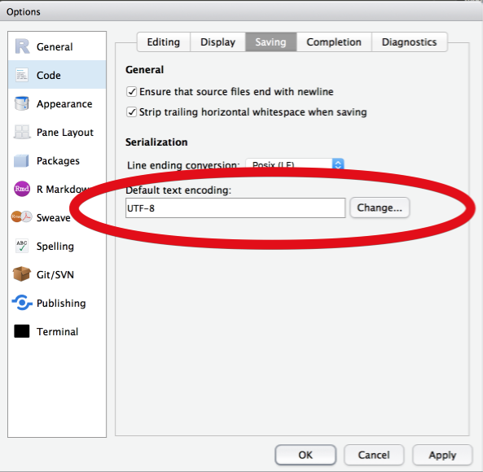

# Datentypen

```{r, include=FALSE}
knitr::opts_knit$set(unnamed.chunk.label = "datentypen_")
```

Es gibt eine Reihe von Unterscheidungsmöglichkeiten zwischen verschiedenen Arten von Daten.  
Neben der naheliegenden Unterscheidung zwischen "Zahlen" und "Buchstaben" gibt es diverse andere Typen, die R verwendet.  
Technisch gesehen müssten wir hier noch zwischen Typen und Klassen unterscheiden, aber für die meisten unserer normalen Anwendungszwecke ist es nicht unbedingt notwendig Typen und Klassen auseinanderhalten zu können, weshalb wir hier auch mehr oder weniger beides gleichzeitig abhandeln.

*"Und wieso sollte uns interessieren, wie R da unterscheidet?"*  
R ist verwirrt, wenn wir Buchstaben in eine Funktion stecken, die Zahlen erwartet. Genauso ist R verwirrt, wenn wir den Mittelwert aus einer Tabelle berechnen wollen. Mittelwerte sind nur dann sinnvoll, wenn wir sie aus einem Vektor aus numerischen Werten berechnen. Da eure Daten in verschiedenen Formaten ankommen, und unterschiedliche Repräsentationen unterschiedliche Vor- und Nachteile haben, ist es wichtig, dass ihr im Zweifelsfall herausfinden könnt was ihr da vor der Nase habt und wie ihr damit arbeiten könnt.  
Was eine R-Funktion mit einem Objekt anstellt hängt von der *Klasse* des Objekts ab, das ganze fällt vermutlich irgendwo unter *"object oriented programming"*, und wenn ihr InformatikerInnen kennt und die euch Fragen, ob R eine funktionale oder objektorientierte Frage ist, könnt ihr getrost "ja" sagen[^logic].

Die wichtigste Funktion für diesen Abschnitt ist `class()`, was euch sagt was R unter einem bestimmten Objekt versteht (die *Klasse* des Objekts):

```{r}
class(4)
class(c(1, 2, 3))
class(c("hallo", "welt"))
class(sleep)
class(sleep$extra)
class(sleep$group)
```

<small>(Was es mit `factor` auf sich hat sehen wir ein paar Abschnitte weiter)</small>

Zusätzlich gibt es `typeof()`, eine Funktion, die so speziell ist, dass ich sie in meinen ~4 Jahren R erst neulich entdeckt habe, weil der exakte *Typ* eines Objekts meistens weniger relevant ist als die *Klasse*:

```{r}
typeof(4)
typeof(c(1, 2, 3))
typeof(c("hallo", "welt"))
typeof(sleep)
typeof(sleep$extra)
typeof(sleep$group)
```

## Numeric <small class="subtitle">(Zahlen und so)</small>

Zahlen in R (und in den meisten anderen Programmiersprachen, beziehungsweise generell irgendwo, wo Maschinen rechnen) kommen in zwei Geschmacksrichtungen: **Integer** (ganze Zahlen) und **double** (Dezimalzahlen, Fließkommazahlen, *floating point numbers*).  
Der Grund dafür hat damit zu tun, wie Computer intern Zahlen abbilden, binäres Zahlensystem, Bits, ihr wisst schon — komplizierter Kram wo sich kluge Menschen Dinge ausdachten, mit denen wir arbeiten können, wir aber nicht im Detail verstehen müssen.  
Fließkommazahlen sind so gängig, dass R sogar eine einfache ganze Zahl wie `2` erstmal als *double*, also praktisch als `2.0` interpretiert, und wir explizit `2L` schreiben müssen, wenn wir *"2, aber als integer"* meinen. Wieso wir dafür `L` brauchen sei dahingestellt, aber nun ja, der Unterschied ist da:

```{r}
# Beides "numeric"
class(2)
class(2.5)

# Aber…
typeof(2L)

# …und
typeof(2.5)
```


Integers sind ziemlich unproblematisch, werden aber in der Praxis nicht häufig explizit genutzt.  
Fließkommazahlen (*double*) hingegen tauchen häufiger auf, weil Computer in den letzten Jahrzehnten *echt verdammt gut* darin geworden sind, mit Fließkommazhalen zu rechnen. Arithmetik mit integers ist auch okay, aber wenn eure Datensätze riesig und eure Statistik komplex ist, dann ist Geschwindigkeit von Rechenoperationen auf ein mal ein wichtiger Faktor.  
Das Problem an der Sache ist nur leider, dass Fließkommazahlen seltsam sind. Nicht nur vom initialen Verständnis her, dazu empfehle ich euch herzlichst [dieses schöne Video von Tom Scott](https://www.youtube.com/watch?v=PZRI1IfStY0), sondern auch für ganz reale Konsequenzen, über die wir stolpern können, wenn wir nicht aufpassen:

```{r}
# Wurzel aus 2, ganz harmlos
sqrt(2)

# Quadrierte Wurzel aus 2 ergibt 2, ja, kommt hin
sqrt(2)^2

# Das sollte ja dann…
sqrt(2)^2 == 2
```

<small>Wait, what?</small> 

Und das ist der Grund warum Fließkommazahlen (*double*) seltsam sind.  
Die kurze Version: $\sqrt{2}$ ist eine *irrationale Zahl*, das heißt sie hat *unendlich viele Nachkommastellen*. Computer können nur eine begrenzte Anzahl an Nachkommastellen speichern, weshalb das Resultat von einer Berechnung wie $\left(\sqrt{2}\right)^2$ zwar für alle praktischen Zwecke immer noch 2 ist, aber *irgendwie auch nicht*. Wenn wir mit Datensätzen arbeiten und darin rumrechnen dann sind solche kleinen Rundungsfehler egal, aber wenn wir uns auf Operatoren wie `==` verlassen, um berechnete Werte zu vergleichen, dann müssen wir vorsichtig sein.  

An dieser Stelle ein kurzer Exkurs in die Numerik:  
Die absolut kleinste Toleranz, die euer Computer für Fließkommazahlen berücksichtigt, könnt ihr euch mit `.Machine$double.eps` anzeigen lassen[^bits]. `.Machine` ist ein besonderes Objekt in R, dass Informationen zu eurem Computer (sprich eurer *Maschine*) sammelt.  

```{r}
# Wie groß ist die Abweichung vom erwarteten Ergebnis?
sqrt(2)^2 - 2
```

`4.4408920985e-16` ist Computer für $4.4408920985 \cdot 10^{-16}$, also ungefähr…

$$\frac{4.4408920985}{10000000000000000} \approx 0.00000000000000044$$

Das ist… ziemlich wenig, und im Alltag auch ziemlich egal, aber wie gesagt: Für R ist das ein Unterschied.

```{r}
# Wie groß ist die Toleranz?
.Machine$double.eps

# Moment mal…
.Machine$double.eps * 2

# Wenn jetzt…
(.Machine$double.eps * 2) == (sqrt(2)^2 - 2)
```

Tatsache.  
Wir könnten noch weiter damit rumspielen, aber als Lektion sollte eigentlich nur hängenbleiben, dass Zahlen in R gerne mal mehr sind, als euch in der Konsole angezeigt wird.

```{block2, float-rounding, type='rmdimportant'}
> One does not simply *round* floating point numbers
> --- [Programmer Boromir](https://ironholds.org/projects/rbitrary/#why-doesnt-round-work-like-you-think-it-should)

```

Wenn ihr mal auf sowas stoßen solltet, dann verwendet am besten einfach die Funktion `round()` um eure Werte auf eine sinnvolle Anzahl Nachkommastellen zu runden:

```{r}
# Auf 5 Stellen gerundete Wurzel 2
round(sqrt(2), digits = 5)

# Gerundetes Ergebnis von "Wurzel 2 hoch 2"
round(sqrt(2)^2, digits = 5)

# Literally close enough.
round(sqrt(2)^2, digits = 5) == 2
```

```{block2, float-rounding_tip, type='rmdtip'}
Im Zweifelsfall einfach Genauigkeit opfern um den Verstand zu behalten
```

Theoretisch ist "numeric" für Zahlen eine *Klasse*, und *integer* und *double* sind die beiden *Typen*, aus denen die Klasse besteht.

## Character <small class="subtitle">(Buchstabenzeugs)</small>

*Characters* sind *Strings* sind *irgendwas was aus mehr als nur Zahlen besteht* (zumindest meistens). Die Unterscheidung zwischen *numeric* und *character* ist intuitiv ziemlich einfach, und in eurer statistischen Praxis werdet ihr vermutlich meistens auf *numerics* treffen, wobei *characters* dann meistens nur für nominale Variablen (Gruppenzugehörigkeiten, Entscheidungen für *A*, *B*, *C*) gebraucht werden. Tatsächlich werden eure nominalen Variablen sogar eher als `factor` daherkommen, dazu dann der nächste Abschnitt.

Characters verhalten sich im Grunde wie Worte. Wir können sie aneinanderhängen, wir können sie vergleichen, aber wir können zum Beispiel keine Berechnungen damit durchführen:

```{r}
namen <- c("Lukas", "Tobias", "Christoph")
mean(namen)

# Zahlen != Buchstaben
5 == "5"

# Groß- / Kleinschreibung ist wichtig!
"Lukas" == "Lukas"
"Lukas" == "LUKAS"

# Strings aneinanderhängen
paste("Lukas", "hat", "Spass", sep = "_")
```

Die Funktionen `paste` und `paste0` sind zirmlich praktisch wenn ihr mit Strings arbeitet, die werdet ihr früher oder später mal brauchen.  
Ansonsten dürfte euch aufgefallen sein, dass man *Spaß* mit *ß* schreibt. Das ist korrekt. Allerdings zählt *ß* als Sonderzeichen, genauso wie Umlaute (*üöä*). R kann damit zwar prinzipiell umgehen, solange ihr das richtige *Encoding* verwendet, aber dennoch bietet es sich an auf Sonderzeichen in R-Code zu verzichten, um Inkompatibilität mit anderen vorzubeugen.

Um eure Einstellungen anzupassen und auf Nummer sicher zu gehen, öffnet die Einstellungen von RStudio und setzt die folgende Einstellung auf **UTF-8** (Unicode):

```{r, echo=FALSE, fig.cap="RStudio > Optionen > Code > Saving: UTF-8"}

```

Encoding ist so der einfachste Grund aus dem eure Scripte und Dokumente auf einmal kaputt aussehen, wenn ihr sie von einem Windows-Rechner an einen Mac oder eine Linux-Kiste schickt. Mac und Linux können sich wenigstens meistens auf Unix-Standards und Unicode eignen, aber Windows… Windows ist seltsam.

```{block2, encoding, type="rmdimportant"}
Encoding ist kodifizierter Selbsthass, aber [Unicode ist großer Spaß](https://romain.rbind.io/blog/2017/08/03/unicode-utf-8-strings-and-emojis/)
```

## Factor <small class="subtitle">(Here be dragons)</small>

Okay, der haarige Teil.  
Die `factor`-Klasse in R ist unheimlich praktisch, aber auch ziemlich unintuitiv bei der ersten Verwendung. Das liegt nicht zuletzt daran, dass ein `facotr` von aussehen meistens einfach aussieht wie ein `character`, aber nunmal kein `character` ist.  
*Factors* haben zwei Bestandteile:

- `level`: Die *Merkmalsausprägung*, so wie R den `factor` sieht. Meistens *numeric*.
- `label`: (*Optional*) Die *Bezeichnung der Merkmalsausprägungen*, meistens `character`, für die bessere Lesbarkeit.

Ein Beispiel aus dem `sleep`-Datensatz:

```{r}
# Die Vairable "group"
sleep$group

# …hat die Klasse "factor"
class(sleep$group)

# Und die levels…
levels(sleep$group)
```

Wir sehen, dass `group` die Merkmalsausprägungen (*levels*) `1` und `2` hat, aber das ist für uns möglicherweise nicht wirklich aussagekräftig. Wir können die Variable modifizieren, und einen schöneren `factor` daraus machen:

```{r}
# Wir modifizieren nur die labels, nicht die level
sleep$group <- factor(sleep$group, levels = c(1, 2), labels = c("Medikament A", "Medikament B"))

# Jetzt werden uns unsere Labels angezeigt
sleep$group

# Und unsere unveränderten Levels
levels(sleep$group)

# Aber wir können den factor immer noch wie Zahlen behandeln
as.numeric(sleep$group)
```

Mit `factor` können wir praktisch zwei Lagen an Informationen in nur einer Variable speichern, einmal numerische *levels* und einmal character *labels*. Die Levels sind die eigentlich wichtige Information und die Labels sind praktisch nur für uns zur besseren Lesbarkeit da, zum Beispiel bei Tabellen oder Grafiken.  

## Besondere Typen

Eure Daten kommen meistens von anderen, zumindest in den ersten Semestern eures Studiums.  
Meistens kommen eure Daten auch mit Fehlenden oder irgendwie kaputten Werten, mit denen ihr ohne Weiteres nichts anfangen könnt.  

### Fehlende Werte: `NA`

Vermutlich der wichtigste Datentyp, der euch begegnen wird. `NA` steht für *Not Available* und heißt, dass es an dieser Stelle einfach keinen Wert gibt. In einem Fragebogen wäre das zum Beispiel eine nicht ausgefüllte Frage, und das heißt für euch, dass ihr ohne Weiteres keine Annahme über diese Wert machen könnt. `NA` heißt nicht "da ist nichts", sondern eher "da könnte was sein, aber ich weiß nicht".  
Das ist auch der Grund, warum der Mittelwert nicht funktioniert, wenn da `NA` drinstecken:

```{r}
mean(c(1, 2, NA, 4, 5, NA, 7))
```

Klar könnten wir einfach annehmen, dass die fehlenden Werte `3` und `6` sind, aber das wissen wir nunmal nicht, und da R in der Regel nicht rät, sagt es halt auch "weiß nicht" in Form von `NA`.  
In solchen Fällen müsst ihr explizit `NA` ignorieren:

```{r}
mean(c(1, 2, NA, 4, 5, NA, 7), na.rm = TRUE)
```

Ihr könnt auch mit der Funktion `is.na` prüfen, ob ihr fehlende Werte habt. Beachtet, dass `==` zum vergleichen nicht funktioniert!

```{r}
zahlen <- c(1, 2, NA, 4, 5, NA, 7)

is.na(zahlen)

# Alle 'zahlen', für die is.na() _nicht_ TRUE ist
zahlen[!is.na(zahlen)]

# An welcher Position sind die NAs?
which(is.na(zahlen))
```


### Leere Werte: `NULL`

Wenn `NA` fehlende Werte sind, was soll dann `NULL` sein?  
Naja, ich merke mir das immer ungefähr so:

- `NULL`: Da ist *nichts*, also so wirlich _*nichts*_, und ich weiß das auch!
- `NA`: Da ist zwar *nichts*, aber ich hab _*keine Ahnung*_ ob da nicht doch was sein sollte ¯\\\_(ツ)_/¯

`NULL` wird euch vermutlich weniger häufig begegnen als `NA`, zumindest in Datensätzen.  
Ansonsten taucht `NULL` eher bei R-Funktionen als *default argument* auf, also ein Argument einer Funktion, das nicht gesetzt ist, außer ihr setzt es explizit. Das klingt jetzt etwas abstrakt, aber wir werden im Laufe dieser Einführung vermutlich noch Beispiele dafür sehen.

```{block2, null_na, type="rmdnote"}
`NULL` ist leer, und zwar mir Sicherheit  
`NA` ist leer, aber man weiß es nicht so recht
```

### To `Inf` and Beyo`NaN`d!

Habt ihr schonmal durch 0 geteilt? Oder überlegt was $0^0$ ist?  
Das ist die Ecke, in der `Inf` und `NaN` auftauchen.  

`Inf` und `-Inf` stehen erstmal nur für $\infty$ und $-\infty$ und sind Rs Weg euch zu sagen, dass ihr da gerade den Bereich der alltagstauglichen Zahlen überschritten habt.  
Nehmt mal folgendes Beispiel:

```{r}
# 2 hoch 10… geht noch
10^10

# Auch das…
10^100

# Okay, aber jetzt…
10^1000
```

Das ist R einfach zu viel, bzw. es ist eurem Computer generell zu viel.  
Kurzer reminder: `1e10` ist Computer für $1 \cdot 10^{10}$, also eine 1 mit 10 Nullen, also…

$$1e10 = 1 \cdot 10^{10} = 10000000000$$

Dementsprechend könnt ihr euch vorstellen, wie groß $10^{1000}$ wäre, und R macht solche Späße nicht mit und sagt einfach `Inf`.  
Wenn ihr `Inf` oder `-Inf` in euren Ergebnissen seht, dann solltet ihr nur wissen, dass es da ein entweder *viel zu großes* oder *viel zu kleines* Ergebnis gab. 

Und dann ist da noch die Sache mit `NaN`.  
`NaN` steht für *not a number* und passiert dann, wenn ihr irgendwas mathematisch fragwürdiges macht, wie zum Beispiel 0 durch 0 teilen:

```{r}
0/0
```

Das ist mathematisch nicht definiert, und wieso das so ist und mehr dazu findet ihr zum Beispiel bei [Numberphile](https://www.youtube.com/watch?v=BRRolKTlF6Q) gut erklärt.  
Hier solltet ihr auch nur wissen, dass es das gibt und dass ihr es im Zweifelsfall vermeiden wollt, wenn es in euren Ergebnissen auftaucht.

## Tabellen: `data.frame`

All eure Datensätze im Studium kommen in Tabellenform.  
Tabellen in R sind im Grunde nichts anderes als Listen von Vektoren mit gleiche Länge: Der `sleep`-Datensatz zum Beispiel besteht aus drei Vektoren der Länge 20, und jede Spalte verhält sich wie ein Vektor mit bestimmten Typen.  
Um sich einen Überblick über einen Datensatz zu verschaffen empfiehlt sich die Funktion `str` (lies *structure*), oder auch `head`:

```{r}
# Die ersten paar Zeilen
head(sleep)

# Nur die ersten 2 Zeilen
head(sleep, n = 2)

# Struktur des Datensatzes
str(sleep)

```

Das Output von `str` sagt euch alles, was ihr braucht:

- Die *Klasse* des Objekts, hier ein `data.frame`, das Tabellenformat
    - Die Anzahl der Zeilen (`20 obs.`), und Spalten (`3 variables`)
- Die Spalten der Tabelle mit den ersten Werten
    - `extra`: Numerisch (`num`)
    - `group`: `factor` mit 2 Merkmalsausprägungen (`w/ 2 levels`), die *Labels* und die *Levels*
    - `ID`: `factor` mit 10 *Labels* (`"1", "2", "3" …`) und *Levels* (`1 2 3 4 …`)
    
Später werden wir noch andere Klassen für Tabellen sehen, die `data.frame` erweitern bzw. etwas aufhübschen, namentlich wird das [`tbl_df` bzw. `tibble`](http://tibble.tidyverse.org/) sein, aber dazu müssen wir uns erst *Packages* ansehen.  

## Prüfen & Konvertieren {#convert}

Was wir im Abschnitt zu `factor` am Ende mit `as.numeric` gemacht haben fällt unter *Coercion*, und heißt, dass Werte eines Typs in einen anderen Typ konvertiert werden sollen. Das Gegenstück dazu wäre `is.numeric`, was nachsieht, ob eine Variable bereits *numeric* ist.

```{r}
as.numeric("5")
as.numeric(5)

as.character(c(2, 5, 4, 3))
```

Es gibt etliche solcher Konvertierungsfunktionen in R, manche mehr oder weniger nützlich, aber nun gut, sie sind da:

```{r}
# Römische Zahlen
as.roman(2017)

# Hexadezimal
as.hexmode(255)

# Logische Werte
as.logical(0)
as.logical(1)
```


<!-- Footnotes -->

[^bits]: Habt ihr mal im Kontext von Computern oder Betriebssystemen/Software von "32bit" und "64bit" gehört? Da geht's tatsächlich genau um dieses Ding mit den Fließkommazahlen. 64 bit kann einfach mehr Nachkommastellen speichern als 32bit. Vergleiche dazu auch `.Machine$double.digits` auf einem 32bit gegen ein 64bit-Betriebssystem

[^logic]: Das ist einer von diesesn Logikwitzen basierend auf dem Umstand, dass das logische *oder* (`a | b`) auch *wahr* ist, sowohl `a` als auch `b` *wahr* ist.
