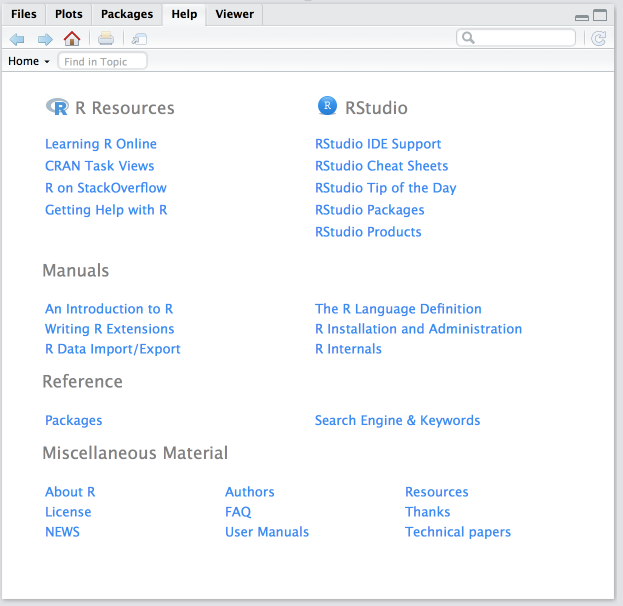

# Die Hilfe

Wir haben bereits Seiten wie [rdrr.io](https://rdrr.io/) und [rdocumentation.org](https://www.rdocumentation.org/) erwähnt, wo ihr euch Dokumentation anschauen könnt. Unter *Dokumentation* verbirgt sich übrigens nichts weltbewegendes, in der Regel geht es nur darum wie einzelne Funktionen zu benutzen sind.
Diese Seiten sind im Wesentlichen aufgebohrte Versionen der Hilfe, die R von Haus aus mtibringt — allerdings mit bells & whistles in Form von schönerer Optik, erweiterter Suchfunktion, Verlinkungen etc.

Diie Hilfe findet ihr auf der rechten Seite in RStudio, unter dem `"Help"`-Tab:

```{r, fig.cap="Die Startseite der R-Hilfe"}

```

In die Suchleiste oben rechts könnt ihr Suchbegriffe eingeben. Denkt daran, dass die Hilfe in erster Linie auf englisch verfügbar ist.

## Format

Die Dokumentation von Funktionen hat immer das gleiche Format mit bestimmtem Pflichtbereichen und mehreren optionalen Abschnitten.

- **Description**:
- **Usage**:
- **Value**:
- **See Also**:
- **Examples**:

## Sprache

Die R-Hilfe ist primär auf englisch verfügbar.   
Wenn euch das überrascht, dann geht mal vor die Tür.  
Zusätzlich ist die Hilfe meistens den AutorInnen der jeweiligen Packages/Funktionen geschrieben, was zwar den Vorteil hat, dass sie in der Regel zumindest inhaltlich korrekt ist, aber für Laien manchmal nur so mäßig verständlich ist, was da jetzt eigentlich genau gesagt wird.
