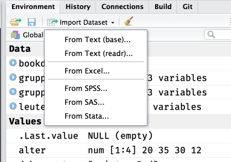

# Datenimport

Im Laufe eures Studiums (und vermutlich darüberhinaus) werdet ihr sehr viel Zeit damit verbringen Daten aus verschiedenen Quellen in die Statistiksoftware eurer Wahl (oder auch nicht eurer Wahl, aber der eurer Arbeitstselle) zu quetschen.  
Das funktioniert mal mehr und mal weniger einfach, denn je nachdem wie die Originaldaten aussehen, kann das mitunter anstrengend bis deprimierend werden.  
Saubere (*tidy*) Daten sehen immer gleich aus, aber unsaubere Daten sind alle auf ihre eigene Art unsauber. Mal fehlen Variablenbeschriftungen, mal sind da Umlaute durch Encoding kaputtgegangen, manchmal werden numerische Werte als *character* interpretiert und manchmal sind fehlende Werte mit irgendwelchen willkürlichen Werten kodiert (z.B. `-99` anstatt `NA`).  

Vielleicht wundert ihr euch auch, wieso dieses Kapitel erst so spät in dieser Einführung auftaucht. Das liegt primär daran, dass ihr unter Umständen ein ausreichend großes Repertoire an Grundlagen braucht, um Daten auf alle Fälle sauber eingelesen zu bekommen.  
In vielen Fällen, und besonders in QM, ist das Ganze noch relativ überschaubar und eure TutorInnen können entsprechende Hilfestellung bieten, aber *irgendwann* seid ihr auf euch allein gestellt, und dann macht ein bisschen Bonus-Wissen hier und da den Unterschied zwischen einem anstrengenden Nachmittag voller Leid und Schmerz oder 10 Minuten Probiererei und schnellem Erfolg.

## Quellen

Da in QM nur SPSS und R benutzt werden, werdet ihr vermutlich meistens auf Datensätze aus SPSS (`.sav`) stoßen. R kann zwar SPSS-Daten einlesen, aber SPSS kann mit R-Daten nichts anfangen. Außerdem beinhalten SPSS-Datensätze auch ein bisschen Metadaten, wie zum Beispiel Labels für eure Variablen oder nominalskalierte Variablen, die wir in R dann für bessere Optik benutzen können — andere Formate wie Textdateien (`.csv`, `.txt`, *plain text*) sind spartanischer und haben sowas nicht.    

Die einfachste Option ist meistens die RStudio-Funktio zum Datenimport, aber auch hier solltet ihr erstmal wissen, wo eure Daten herkommen und ggf. über die ein oder andere Eigenart bescheid wissen.

```{r, fig.cap="RStudio Import-Tool"}

```

Eine Sache noch zum Encoding: Um kaputte Umlaute und andere Krämpfe zu vermeiden bietet es sich an, **überall alles immer** auf Unicode bzw. **UTF-8** zu stellen wenn ihr _irgendwo_ nach Encoding gefragt werdet.

### Roher Text (`.csv`, `.txt`)

- Benötigte packages: `readr`
- Anstrengend? Entweder alles super oder Riesenkrampf

### SPSS (`.sav`)

- Benötigte packages: `haven` oder `sjmisc`
- Anstrengend? Manchmal.

### R (`.rds`, `.rda`)

- Benötigte packages: Keins (Base R reicht, optional `readr` als Alternative)
- Anstrengend? Nope, alles tutti.

Der wohl einfachste und dankbarste Anwendungsfall: Von R zu R.  
Hier habt ihr zwei Möglichkeiten: `.rds` und `.rda`: Generell scheint `.rds` die präferierte Option zu sein.

#### `.rds`

Daten einlesen ist simpel:

```r
datensatz <- readRDS("pfad/zur/Datei.rds")
```

Daten speichern auch:

```r
saveRDS(datensatz, "pfad/zur/datei.rds")
```


#### `.rda`

```r
load("pfad/zur/datei.rda")
```


### Google Sheets

- Benötigte packages: `googlesheets`
- Anstrengend? Meistens geht's ganz gut.

### Excel (`.xlsx`)

- Benötigte packages: `readxl`
- Anstrengend? Manchmal.


## Sauber machen

- `names`
- dplyr: `mutate`, `recode[_factor]`
- tidyr

Um festzustellen, ob eure frisch eingelesenen Daten auch brauchbar sind, empfiehlt sich ein Blick in die Daten via `View(daten)` bzw. Über einen Klick auf den Datensatz im *Environment*-Tab von RStudio.  
Zusätzlich ist auch hier natürlich `str()´ praktisch, um zum Beispiel schnell zu überprüfen, ob eure Variablen auch alle die Klasse haben, die ihr erwartet (alle Zahlen sind *numeric* und Nominaldaten sind *factor* oder wenigstens *character*).
