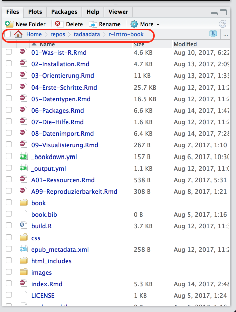

# Datenimport

Im Laufe eures Studiums (und vermutlich darüberhinaus) werdet ihr sehr viel Zeit damit verbringen Daten aus verschiedenen Quellen in die Statistiksoftware eurer Wahl (oder auch nicht eurer Wahl, aber der eurer Arbeitstselle) zu quetschen.  
Das funktioniert mal mehr und mal weniger einfach, denn je nachdem wie die Originaldaten aussehen, kann das mitunter anstrengend bis deprimierend werden.  
Saubere (*tidy*) Daten sehen immer gleich aus, aber unsaubere Daten sind alle auf ihre eigene Art unsauber. Mal fehlen Variablenbeschriftungen, mal sind da Umlaute durch Encoding kaputtgegangen, manchmal werden numerische Werte als *character* interpretiert und manchmal sind fehlende Werte mit irgendwelchen willkürlichen Werten kodiert (z.B. `-99` anstatt `NA`).  

Vielleicht wundert ihr euch auch, wieso dieses Kapitel erst so spät in dieser Einführung auftaucht. Das liegt primär daran, dass ihr unter Umständen ein ausreichend großes Repertoire an Grundlagen braucht, um Daten auf alle Fälle sauber eingelesen zu bekommen.  
In vielen Fällen, und besonders in QM, ist das Ganze noch relativ überschaubar und eure TutorInnen können entsprechende Hilfestellung bieten, aber *irgendwann* seid ihr auf euch allein gestellt, und dann macht ein bisschen Bonus-Wissen hier und da den Unterschied zwischen einem anstrengenden Nachmittag voller Leid und Schmerz oder 10 Minuten Probiererei und schnellem Erfolg.

Wenn ihr Daten von eurer Festplatte einlesen wollt, und ihr keine Ahnung habt wie Dateipfade funktionieren, was euer *Home Ordner* ist, was beispielsweise `~/Documents` sein soll oder wie ihr rausfindet, *wo* ihr gerade auf euren Computern seid, [dann lest euch das bitte selber an](https://de.wikipedia.org/wiki/Pfadname).  
Auch hier liefert RStudio jedenfalls im "Files"-Tab entsprechende Orientierungshilfe:

```{r, echo=FALSE, fig.cap="RStudio Filebrowser im Projekt dieser Einführung", out.width="50%"}

```

Das rot umrandete ist der Pfad zum Projektordner, in R würde ich den also so eingeben müssen:

```sh
"~/repos/tadaadata/r-intro-book"
```

Wobei die Tilde `~` eine Abkürzung für das Home-Verzeichnis ist.


## Quellen

Da in QM nur SPSS und R benutzt werden, werdet ihr vermutlich meistens auf Datensätze aus SPSS (`.sav`) stoßen. R kann zwar SPSS-Daten einlesen, aber SPSS kann mit R-Daten nichts anfangen. Außerdem beinhalten SPSS-Datensätze auch ein bisschen Metadaten, wie zum Beispiel Labels für eure Variablen oder nominalskalierte Variablen, die wir in R dann für bessere Optik benutzen können — andere Formate wie Textdateien (`.csv`, `.txt`, *plain text*) sind spartanischer und haben sowas nicht.    

Die einfachste Option ist meistens die RStudio-Funktio zum Datenimport, aber auch hier solltet ihr erstmal wissen, wo eure Daten herkommen und ggf. über die ein oder andere Eigenart bescheid wissen.

```{r, echo=FALSE, fig.cap="RStudio Import-Tool", out.width="50%"}
knitr::include_graphics("images/data_import_rstudio.png")
```

Bei den Textdateien sind mit `base` und `readr` die beiden unterschiedlichen Möglichkeiten gemeint, mit denen wir Daten einlesen können, aber mehr dazu im entsprechenden Abschnitt.

Eine Sache noch zum Encoding: Um kaputte Umlaute und andere Krämpfe zu vermeiden bietet es sich an, **überall alles immer** auf Unicode bzw. **UTF-8** zu stellen wenn ihr _irgendwo_ nach Encoding gefragt werdet.

### Roher Text (`.csv`, `.txt`)

- Benötigte packages: `readr`
- Anstrengend? Entweder alles super oder Riesenkrampf

Einfacher Text (*plain text*) ist die einfachste Möglichkeit Datensätze zu speichern bzw. zu übertragen, da Text so ziemlich der kleinste gemeinsame Nenner jeder gängigen Software ist.  **CSV** heißt auch nur *"comma separated values"*, und wird euch vermutlich noch häufiger begegnen. Eine CSV-Datei könnt ihr mit jedem beliebigen Texteditor öffnen (ihr müsst dafür kein Office rauskramen, auf Windows tut es auch das Notepad), und ihr seht dann vermutlich sowas in der Art:

```csv
"extra","group","ID"
0.7,"1","1"
-1.6,"1","2"
-0.2,"1","3"
-1.2,"1","4"
-0.1,"1","5"
3.4,"1","6"
```

Das Prinzip ist ziemlich einfach: In der ersten Zeile stehen die Variablennamen, und in jeder folgenden Zeile steht jeweils der Wert der zugehörigen Variable, getrennt durch ein Komma.  
Die Schwierigkeit kommt dann, wenn die Werte zum Beispiel Text enthalten, der wiederum ein Komma enthalten kann, und der Wert nicht richtig in Anführsungszeichen gesetzt ist. Es gibt auch noch Varianten mit Tabs statt Kommata als Trennzeichen, das wäre dann strenggenommen *TSV* (ihr dürft raten wofür das *T* steht).  
Textformate sind also ziemlich einfach um eure Daten zu speichern oder zu verschicken, aber es ist auch sehr fragil, sobald mal irgendwo ein `"` fehlt oder zu viel ist, wird's kompliziert.

Zum lesen und schreiben empfehle ich herzlichst das `readr`-package mit den Funktionen `read_csv`, `write_csv` etc. zu benutzen, die sind weniger anfällig für Murks als die base-Standardfunktionen mit gleichem Namen aber `.` statt `_` (`read.csv`, `write.csv`).

Als Beispiel laden wir mal [diesen schönen *Game of Thrones*-Datensatz](https://data.world/aendrew/game-of-thrones-deaths):

```{r, message=FALSE, error=FALSE, warning=FALSE}
library(readr)
gotdeaths <- read_csv("data/got_deaths.csv", col_types = cols())

head(gotdeaths)
```

Hier habe ich `col_types = cols()` nur benutzt, um das Output zu unterdrücken. Ihr könnt über dieses Argument aber auch manuell spezifizieren, welchen Typ jede Spalte haben soll, damit eure Daten explizit so eingelesen werden, wie ihr sie erwartet.  
Die schmutzigen Details gibt's natürlich in der Hilfe: `?read_csv` und [online](http://readr.tidyverse.org/).

### SPSS (`.sav`)

- Benötigte packages: `haven` oder `sjmisc`
- Anstrengend? Manchmal.

### R (`.rds`, `.rda` & `.RData`)

- Benötigte packages: Keins (Base R reicht, optional `readr` als Alternative)
- Anstrengend? Nope, alles tutti.

Der wohl einfachste und dankbarste Anwendungsfall: Von R zu R.  
Hier habt ihr zwei Möglichkeiten: `.rds` und `.rda` (auch `.RData`): Generell scheint `.rds` die präferierte Option zu sein.

#### `.rds`

Daten einlesen ist simpel:

```{r}
qmsurvey <- readRDS("data/qm_survey_ss2017.rds")

tibble::as_tibble(qmsurvey)
```

Wir benutzen hier das `tibble` package nur, damit der Datensatz kompakter angezeigt wird. Das ist für euch keine Notwendigkeit, aber ich empfehle es in der Regel gerne, weil euch so nicht die Konsole vollgeklatscht wird, wenn ihr euch euren Datensatz mal schnell anschauen wollt.

Daten speichern auch:

```r
saveRDS(datensatz, "pfad/zur/datei.rds")
```

Hier zum Beispiel der Datensatz zur Tutoriumsteilnahme, den ihr von <https://public.tadaa-data.de/data/participation.rds> runterladen könnt:

```r
participation <- readRDS("~/Downloads/participation.rds")
```

Alternativ könnt ihr das `readr`-package benutzen. Die Funktion daraus sieht fast gleich aus, ist aber theoretisch etwas schneller — unabhängig davon welche Funktion besser ist, wisst ihr jetzt zumindest, dass es zwei Möglichkeiten gibt.

```r
library(readr)
participation <- read_rds("~/Downloads/participation.rds")
```

#### `.rda`, `.RData`

Bei `.rda` bzw. `.RData`-Dateien ist zu beachten, dass diese den Namen des Objekts gleich mitspeichern, das heißt ihr müsst den eingelesenen Datensatz keinen Namen geben — der kommt schon mit der Datei.  
Theoretisch kann so eine Datei auch mehrere Variablen enthalten, und wenn ihr zum Beispiel RStudio schließt und wieder öffnet, dann werden in der Zwischenzeit auch eure Variablen der aktuellen Session in Form einer `.RData`-Datei im Projektordner abgelegt und beim nächsten Start wieder eingelesen.

```r
load("pfad/zur/datei.rda")

# Oder…
load("pfad/zur/datei.RData")
```

Speichern:

```r
save(datensatz, file = "pfad/zur/Datei.rda")
```

### Excel (`.xlsx`)

- Benötigte packages: `readxl`
- Anstrengend? Manchmal. Aber wenn, dann *richtig*.

Wenn ihr ein sauberes (i.e. ohne Schnickschnak) Spreadsheet habt in dem auch wirklich nur eure Werte drinstehen, dann ist das Ganze recht simpel und ihr seid mit `readxl` auch gut bedient.  
Wenn ihr einen dreckigen Haufen dampfender Menschenverachtung vor euch habt, dann… viel Spaß.  
Es gibt da [das ein oder andere Projekt](https://github.com/rsheets/rexcel#rexcel) für die komplexeren Fälle, aber wenn ihr die Möglichkeit habt, macht es euch so einfach (und rechteckig) wie möglich.

### Google Sheets

- Benötigte packages: `googlesheets`
- Anstrengend? Meistens geht's ganz gut.

Wenn euch Excel zu unpraktisch ist, dann bietet sich [Google Sheets](https://www.google.com/sheets/about/) an. Es ist kostenlos, einfach und ausreichend mächtig für alles, was ihr so vorhaben könnten — mitunter weil ihr für alle komplexeren Sachen sowieso R benutzen wollt. Sheets ist praktisch wie Excel, nur halt in der Cloud<sup>TM</sup> und von Google, aber für überschaubare Datensammlungen reicht's auf alle Fälle. Die [Tutoriumsteilnahmedaten haben wir da auch gesammelt](https://qmparticipation.tadaa-data.de/), und da das Sheet immer an der selben Stelle ist muss man einfach nur den Code zum einlesen und auswerten erneut ausführen und schon hat man eine mehr oder weniger selbstupdatende Analyse. Nett.

In besagtem Projekt sieht das zum Beispiel so aus:

```r
participation_1 <- gs_title("Tutoriumsteilnehmer") %>%
  gs_read(ws = "WS1516", range = cellranger::cell_cols(1:7)) %>%
  arrange(Datum, Uhrzeit) %>%
  mutate(Studienjahr = "15/16",
         SemesterID  = "WiSe 15/16")
```

Zuerst müsst ihr aber die Authentifizierung mit eurem Google-Account abhandeln:

```r
library(googlesheets)

gs_ls()
```

Mit diesem Befehl zeigt euch das package all eure Google Sheets an nachdem es euch nach einem Login gefragt hat, von da aus könnt ihr dann weiterarbeiten. 
Mehr Informationen und Beispiele [gibt's in der Vignette](https://rawgit.com/jennybc/googlesheets/master/vignettes/basic-usage.html).

## Daten angucken & sauber machen

Um festzustellen, ob eure frisch eingelesenen Daten auch brauchbar sind, empfiehlt sich ein Blick in die Daten via `View(daten)` bzw. Über einen Klick auf den Datensatz im *Environment*-Tab von RStudio (das da oben rechts).  
Zusätzlich ist auch hier natürlich `str()` praktisch, um zum Beispiel schnell zu überprüfen, ob eure Variablen auch alle die Klasse haben, die ihr erwartet (alle Zahlen sind *numeric* und Nominaldaten sind *factor* oder wenigstens *character*).

Es gibt da kein one-size-fits-all Rezept zur Datenbereinigung, denn jeder Datensatz ist auf seine eigene Art dreckig. Ihr könnt nur darauf hoffen, dass euer konkreter Anwendungsfall gut googlebar ist, oder ihr sowas ähnliches schonmal gemacht habt.  
Die gängigsten Probleme sind recoding, umbenennen oder zusammenfassen, und das meiste lässt sich entweder mit `dplyr`, `sjmisc` oder ggf. `tidyr` erledigen. Versucht es erstmal innerhalb des *tidyverse*, das ist vermutlich angenehmer als zusammengehackte Google-Lösungen. Aber auch hier, wie gesagt: Je nachdem was ihr vorhabt. Mehr dazu findet sich in [Data Munging].

### Datenimport: Beispiele 

> Happy families are all alike; every unhappy family is unhappy in its own way.
>
> --- Leo Tolstoy

> and every messy data is messy in its own way - it's easy to define the characteristics of a clean dataset 
> (rows are observations, columns are variables, columns contain values of consistent types). 
> If you start to look atreal life
> data you'll see every way you can imagine data being messy (and many that you can't)!
>
> --- Hadley Wickham (answering 'in what way messy data sets are messy') R-help (January 2008)

Datenbereinigung ist entweder sehr einfach oder sehr komplex, oder irgendwo dazwischen. In diesem Sinne: Learning by example und so.

#### Der NGO Datensatz

Der **NGO**-Datensatz aus dem *Kähler* ist seit längere _der_ default Übungsdatensatz und dementsprechend auch unfassbar langweilig für VeteranInnen. Zudem haben wir den Datensatz in sauber auch schon in der `tadaatoolbox`, das heißt, wenn ihr die toolbox ladet könnt ihr `ngo` direkt benutzen.  
In der Vorlesung schwirrt darüberhinaus vermutlich eine SPSS (`.sav`)-Version des Datensatzes rum, die wir hier mal beispielshalber einlesen und bearbeiten, bis sie identisch zur `tadaatoolbox`-Version ist.

```{r ngo_einlese}
library(haven)
ngo <- read_sav("data/NGO.SAV")

head(ngo)
```

Zuerst wollen wir mal die Variablen rauskicken, die wir nicht brauchen. In diesem Fall sind das die Variablen, die wir zu Übungszwecken sowieso selber erstellen wollen: `ZENG`, `ZDEUTSCH`, `ZMATHE`, `INDEX`, `LEIST`

```{r ngo_select}
library(dplyr)

ngo <- ngo %>%
  select(-ZENG, -ZDEUTSCH, -ZMATHE, -INDEX, -LEIST)

head(ngo)
```

Besser. Als nächstes stört mich, dass die Variablennamen alle *UPPER CASE* sind. Ich will die alle in *lower case* haben. Dafür können wir die Funktion `tolower` benutzen.

```{r ngo_names}
names(ngo) <- tolower(names(ngo))

head(ngo)
```

Besser. Als nächstes wollen wir unsere Variablen labeln, zum Beispiel soll `geschl` nicht `1` oder `2` sagen, sondern `Männlich` und `Weiblich`.

```{r ngo_recode}
ngo$geschl   <- factor(ngo$geschl,   labels = c("Männlich", "Weiblich"))
ngo$jahrgang <- factor(ngo$jahrgang, labels = c("11", "12", "13"), ordered = TRUE)
ngo$abschalt <- factor(ngo$abschalt, labels = c("Ja", "Nein"))

# Falls NA noch nicht korrekt kodiert:
ngo$hausauf  <- ifelse(ngo$hausauf  == 0, NA, ngo$hausauf)
ngo$abschalt <- ifelse(ngo$abschalt == 0, NA, ngo$abschalt)

head(ngo)
```

Besser.  
Hier haben wir `jahrgang` auch gleich zu einem `ordered factor` gemacht, damit die Reihenfolge der Merkmalsausprägungen immer intakt bleibt. Gegebenenfalls müssen wir das beachten, falls wir damit mal 'ne [ANOVA](#ANOVA) machen wollen, aber erstmal finden wir das so gut.

Als nächstes können wir noch *labels* setzen, die dann in `sjPlot`-Plots und Tabellen angezeigt werden. Bei unseren frisch erstellten `factor`-Variablen ist das nicht mehr nötig, aber `hausauf` könnte welche gebrauchen:

```{r ngo_label_sj}
library(sjlabelled)
ngo$hausauf  <- set_labels(ngo$hausauf,
                           labels = c("gar nicht", "weniger als halbe Stunde",
                                      "halbe Stunde bis Stunde", "1 bis 2 Stunden",
                                      "2 bis 3 Stunden", "3 bis 4 Stunden",
                                      "mehr als 4 Stunden"))

ngo$hausauf
```

Als letztes können wir noch ein paar Variablen-Labels verteilen:

```{r ngo_var_labs}
ngo$geschl   <- set_label(ngo$geschl,   "Geschlecht")
ngo$abschalt <- set_label(ngo$abschalt, "Abschalten")
ngo$jahrgang <- set_label(ngo$jahrgang, "Jahrgang")
ngo$hausauf  <- set_label(ngo$hausauf,  "Hausaufgaben")
```

...Wir könnten noch mehr Labels verteilen, aber das sind so die Variablen, die am ehesten in Kontingenztabellen auftauchen, von daher reicht mir das so.  

Fertig.  
Sauber.  
Wenn ihr den Datensatz so als Datei wegspeicher wollt, geht das einfach mit:

```r
saveRDS(ngo, "ngo.rds")
```

Der ganze Code zum Saubermachen in einem großen Blob:

```r
library(haven)
library(sjlabelled)
library(tibble)
library(dplyr)

# Einlesen
ngo <- read_sav("data/NGO.SAV")

# Variablen rauskicken
ngo <- ngo %>%
  select(-ZENG, -ZDEUTSCH, -ZMATHE, -INDEX, -LEIST)


# Variablennamen in lower case
names(ngo) <- tolower(names(ngo))

# Recoding
ngo$geschl   <- factor(ngo$geschl,   labels = c("Männlich", "Weiblich"))
ngo$jahrgang <- factor(ngo$jahrgang, labels = c("11", "12", "13"), ordered = TRUE)
ngo$abschalt <- factor(ngo$abschalt, labels = c("Ja", "Nein"))

#### Falls NA noch nicht korrekt kodiert:
ngo$hausauf  <- ifelse(ngo$hausauf  == 0, NA, ngo$hausauf)
ngo$abschalt <- ifelse(ngo$abschalt == 0, NA, ngo$abschalt)

# Value labelling
ngo$hausauf  <- set_labels(ngo$hausauf,
                           labels = c("gar nicht", "weniger als halbe Stunde",
                                      "halbe Stunde bis Stunde", "1 bis 2 Stunden",
                                      "2 bis 3 Stunden", "3 bis 4 Stunden",
                                      "mehr als 4 Stunden"))
# Variable labelling
ngo$geschl   <- set_label(ngo$geschl,   "Geschlecht")
ngo$abschalt <- set_label(ngo$abschalt, "Abschalten")
ngo$jahrgang <- set_label(ngo$jahrgang, "Jahrgang")
ngo$hausauf  <- set_label(ngo$hausauf,  "Hausaufgaben")

# Speichern als Datei
saveRDS(ngo, "ngo.rds")
```

```{r include=FALSE}
rm(ngo)
```


