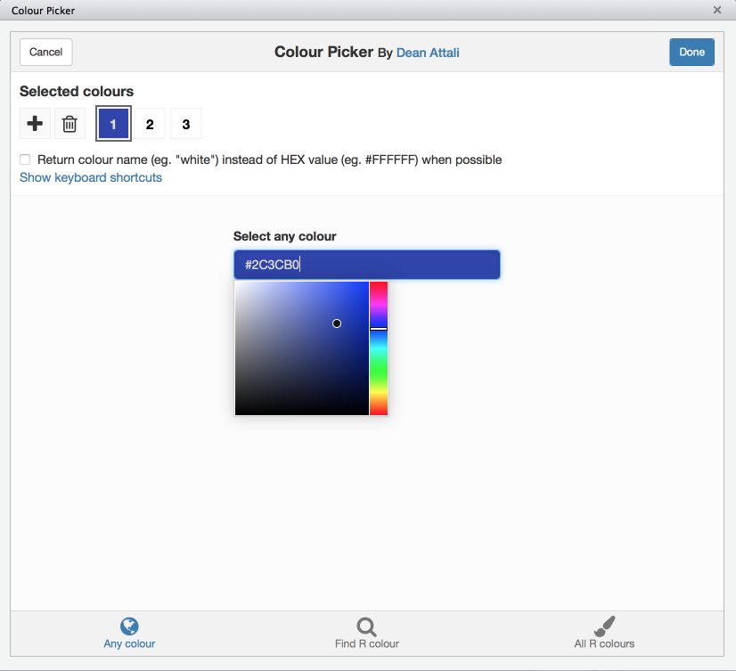
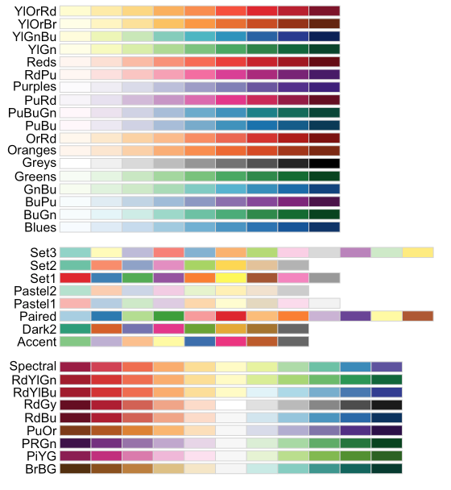

# (PART) Der Spaßige Teil {-}

```{r load_fonts, include=FALSE}
# Fancy font stuff required for hrbrthemes
library(extrafont)
loadfonts()

knitr::opts_knit$set(unnamed.chunk.label = "visualisierung_")
```


# Visualisierung

Es hat ein bisschen gedauert, aber wir mussten uns zuerst erarbeiten, wie wir eigentlich in R mit Daten umgehen können und grob verstehen wie sich R überhaupt verhält, bis wir endlich was spaßiges machen können.  
Und Datenvisualisierung ist vermutlich so ziemlich das spaßigste, was wir in R anstellen können. Eine gute Visualisierung (*Plot*) ist aussagekräftigter als jede schnöde Tabelle, kann unintuitive Zusammenhänge aufdecken und die Interpretation eurer Daten deutlich vereinfachen.  
Deswegen ist der erste Schritt jeder Datenanalyse ein Plot der Daten in verschiedenen Formen um ein Gefühl für die Struktur und die Zusammenhänge dieser Daten zu bekommen.

## ggplot2

[ggplot2](http://ggplot2.tidyverse.org/) ist nicht nur ein R-Packages, es ist auch gleichzeitig eine Implementation des *Grammar of Graphics*. Das klingt fancy (ist es auch), heißt für uns aber in erster Linie nur, dass es gut durchdachter Kram ist.  

```{r}
library(ggplot2)
```

*ggplot2* baut euch einen Plot aus verschiedenen Elementen zusammen, und es hilft durchaus ein grobes Gefühl dafür zu haben, wie das unter der Haube aussieht.

- *geom*: Jedes *geom* ist eine *Lage* des Plots, der Grundlayer ist einfach leer. Jeder weitere Layer enthält `geom`-Elemente, wie Balken, Histogramme, Punkte etc. Ein `geom` ist eine geometrische Darstellungsform, und wenn ihr mehrere Darstellungsformen übereinanderlegen wollt, erstellt ihr damit mehrere *Layer*.
- `aes`: *Aesthetics*, die Zuordnungen einer Variable mit konkreten Werten zu einem Aspekt des Plots, wie zum Beispiel "Alter auf die x-Achse, Körpergröße auf die y-Achse". 
- *scales*: Mit *scales* können wir die einzelnen *aesthetics* bearbeiten, so können wir zum Beispiel die Abstände auf der x-Achse anpassen oder die Beschriftung auf der y-Achse.
- *theme*: Optional können wir jedes optische Element des Plots manuell anpassen, sei es die Schriftart im Titel oder die Farbe des Hintergrunds, die Position der Legende.

Ein Beispiel:

```{r ggplot_firstlook}
ggplot(data = qmsurvey, aes(x = alter, y = feiern)) +
  geom_col() +
  scale_y_continuous(breaks = seq(0, 100, 15), minor_breaks = seq(0, 100, 5)) +
  labs(title = "Alter und Feiern",
       subtitle = "Wie oft gehst du im Monat feiern",
       x = "Alter (Jahre)", y = "Tage pro Monat")
```

Okay, was haben wir da gemacht?  
`ggplot()` macht erstmal einen neuen Plot auf. Mit `data = qmsurvey` sagen wir, mit welchem Datensatz wir arbeiten, und wo ggplot die Namen der Variablen suchen soll, die wir benutzen. `aes()` macht die Verknüpfung von Skalen (`x`, `y`) zu Variablen, soweit alles erwartungsgemäß, kein fancy Voodoo, nur gewöhnungsbedürftiger Syntax.  
`geom_col` macht ein Balkendiagramm auf, und wir haben ja bereits definiert welche Variable wo hin soll.  
In `scale_y_continuous` sagen wir jetzt noch, dass die Achsenabstände in 15er-Schritten liegen sollen, und wir kleinere Abstände (die dünneren weißen Linien) in 5er-Abständen liegen sollen.  
Als letztes kümmern wir uns ein bisschen um die Kosmetik: Wir beschriften unsere Elemente mit `labs()`, wobei wir Title, Untertitel und Achsen beschreiben.

Im Folgenden kommen einige Beispiele, aber grundsätzlich könnt ihr euch alles auch auf der offiziellen Seite unter <http://ggplot2.tidyverse.org> anschauen, wo es auch eine [Referenz aller Funktionen mit Anwendungsbeispielen gibt](http://ggplot2.tidyverse.org/reference/index.html). Ich für meinen Teil habe am Anfang (und auch immer noch) viel Zeit damit verbracht, die Referenz nach etwas zu durchsuchen, dass so grob nach dem aussieht, was ich gerne hätte -- und das dann so lange zu tweaken bis es funktioniert.  
Das Erfolgserlebnis nach ewigem Rungefummel ist nicht zu unterschätzen, aber natürlich ist es hilfreich, wenn man erstmal die Grundlagen erklärt bekommt.

## Layer: `geom_wtf`

Der visuelle Kern eines Plots ist die geometrische Verknüpfung eurer Daten auf einen *Layer*, sowas wie Punkte, Linien, Balken, ihr wisst schon. Ein Plot braucht mindestens einen *Layer* (ein *geom*) um überhaupt irgendwas anzuzeigen, und die entsprechenden Funktionen sind dankbar einfach benannt:

- `geom_point`: Macht Punkte (*Scatterplot*)
- `geom_line`: Macht Linien
- `geom_boxplot`: Boxplots
- `geom_histogram`: Histogramm (Häufigkeitsverteilung)
- `geom_bar`: Balkendiagramm mit Häufigkeiten auf der y-Achse
- `geom_col`: Balkendiagramm mit frei wählbarer y-Achse

### Barcharts & Histogramme

Eine der einfachsten Anwendungsfälle für Visualisierungen sind Balken- und Histogramme. Der Unterschied zwischen den beiden ist eher subtil: Histogramme haben eine numerische/kontinuierliche Variable auf der x-Achse, und Barcharts haben diskrete Variablen auf der x-Achse. Daraus ergibt sich auch, dass Barcharts immer einen Balken pro Merkmalsausprägung haben.  
Die y-Achse ist jeweils die Häufigkeit, mit der die jeweilige Variable auftritt. Diese wird in der Regel als absolute Häufigkeit in ggplot2 angezeigt, aber wir können auch relative Häufigkeiten oder *densities* verwenden.

```{r barchart}
# Balkendiagramm
ggplot(data = gotdeaths, aes(x = death_season)) +
  geom_bar()

# Balken mit relativen Häufigkeiten
ggplot(data = gotdeaths, aes(x = death_season)) +
  geom_bar(aes(y = ..prop..))
```

Das ist zwar schön und gut, aber es sieht noch nicht so wirklich brauchbar aus, und es fehlen vor allem aussagekräftige Beschriftungen. Letztere sind via `labs()` sehr einfach:

```{r barchart_labs}
ggplot(data = gotdeaths, aes(x = death_season)) +
  geom_bar() +
  labs(title = "Game of Thrones: Deaths",
       subtitle = "Deaths per Season",
       x = "Season", y = "# of Deaths")
```

#### `geom_bar` vs. `geom_col` vs `geom_histogram`

Diese drei `geom`s machen *ähnliche* Dinge, nämlich *irgendwas mit Balken(ish)*, aber sie sind nicht beliebig austauschbar.  
In Kürze:

- `geom_histogram`: Histogramm für **numerische, stetige** Variablen
- `geom_bar`: Häufigkeitsverteilung in Balkenform für **diskrete** Variablen (numerisch oder kategorial)
- `geom_col`: Für bivariate Plots mit einem **diskreten** Merkmal auf der *x-Achse* und einer **numerischen** Variable auf der **y-Achse**

### Boxplots und Errorbars

### Scatterplots und Regressionsgerade

### Facetting

### Spaßiger Kram

Via <https://fronkonstin.com/>

```{r plotting_fun_1, cache = TRUE}
library(dplyr)
library(ggplot2)

seq(from = -10, to = 10, by = 0.05) %>%
expand.grid(x = ., y = .) %>%
ggplot(aes(x = (x + pi * sin(y)), y = (y + pi * sin(x)))) +
  geom_point(alpha = .1, shape = 20, size = 1, color = "black") + 
  theme_void()
```


## Mach mal bunt!

Okay, wir wollen also die Balken bunt machen. Es gibt zwei Möglichkeiten: Die `color` und `fill`. Ersteres ist die Farbe (duh), zweiteres die Füllfarbe (duhuh), und unterschiedliche `geoms` haben da entsprechende Unterschiede.

```{r colorfill_1}
ggplot(data = gotdeaths, aes(x = death_season)) +
  geom_bar(color = "red") +
  labs(title = "Game of Thrones: Deaths",
       subtitle = "Deaths per Season",
       x = "Season", y = "# of Deaths")
```

Jetzt haben wir rote Umrandungen. Nicht sehr beeindruckend.

```{r colorfill_2}
ggplot(data = gotdeaths, aes(x = death_season)) +
  geom_bar(fill = "red") +
  labs(title = "Game of Thrones: Deaths",
       subtitle = "Deaths per Season",
       x = "Season", y = "# of Deaths")
```

Ein bisschen grell, aber immerhin rot.

```{r colorfill_3}
ggplot(data = gotdeaths, aes(x = death_season)) +
  geom_bar(fill = "darkred", color = "black") +
  labs(title = "Game of Thrones: Deaths",
       subtitle = "Deaths per Season",
       x = "Season", y = "# of Deaths")
```

Okay, vielleicht ein bisschen Transparenz noch?

```{r colorfill_4}
ggplot(data = gotdeaths, aes(x = death_season)) +
  geom_bar(fill = "darkred", color = "black", alpha = 0.75) +
  labs(title = "Game of Thrones: Deaths",
       subtitle = "Deaths per Season",
       x = "Season", y = "# of Deaths")
```

`alpha` gibt die Durchsichtigkeit des Elements an, von `0` (unsichtbar) bis `1` (keine Transparenz).  
Was die Farben angeht: R kennt `red` und `darkred` neben etlichen anderen Farben.  Diese Farben könnt ihr euch via `colors()` ausgeben lassen — also zumindest die Namen der Farben.  
Alternativ könnt ihr Farben auch als Hex-String angeben, rot wäre dann zum Beispiel `#FF0000`. Wenn ihr mal "rgb color picker" googlet, findet ihr auch entsprechende tools, oder ihr installiert das `colourpicker` package und habt dann sowas direkt in RStudio unter "Addins":

```{r, echo=FALSE, out.width="75%", fig.cap="cap"}

```


### `scale_color_*` und `scale_fill_*`

Wenn wir global die Farbe der Balken ändern wollen, können wir das direkt simpel im `geom_bar()`-Element machen, aber manchmal wollen wir ja auch die Farbe abhängig von einer anderen Variable machen.  

Wenn wir einer *aesthetic* wie `fill` oder `color` eine Variable zuordnen wollen, müssen wir das in `aes()` tun, wo wir auch `x` und `y` definieren. 

```{r scales_1}
ggplot(data = qmsurvey, aes(x = rauchen)) +
  geom_bar()
```

```{r scales_2}
ggplot(data = qmsurvey, aes(x = rauchen, fill = gender)) +
  geom_bar()
```

```{r scales_3}
ggplot(data = qmsurvey, aes(x = rauchen, fill = gender)) +
  geom_bar(position = "dodge", color = "black", alpha = .75)
```

Jetzt haben wir Balken, gefärbt in Abhängigkeit von der Variable `gender`, in den ggplot2-Standardfarben. 
Wenn wir bestimmte Farben für die Zuordnung benutzen wollen, müssen wir die entsprechende `scale` manuell bearbeiten.  
Unter `scale` fällt in ggplot2 jedes Element eines Plots, das sich einer Variable zuordnen lässt, dazu gehören `x` und `y`-Variablen, aber auch die Farbe `color` und Füllfarbe `fill`.  
Also, ein paar Beispiele:

```{r scales_4}
ggplot(data = qmsurvey, aes(x = rauchen, fill = gender)) +
  geom_bar() +
  scale_fill_manual(values = c("red", "blue", "green"))
```

Oh glob, viel zu grell!

```{r scales_5}
ggplot(data = qmsurvey, aes(x = rauchen, fill = gender)) +
  geom_bar() +
  scale_fill_manual(values = c("darkred", "lightblue", "darkgreen"))
```

Besser, aber auch hässlich, nur anders.   
Es stellt sich heraus, dass Farben kompliziert sind. Zumindest, wenn man Ansätze von ästhetischem Anspruch hat.  
Zum Glück sind wir aber nicht auf manuelle Farbauswahl angewiesen, wir können fertige Farbpaletten benutzen, bei denen sich schonmal jemand Gedanken darüber gemacht hat, ob das okay aussieht oder nicht.

### Zusätzliche Farbpaletten

#### RColorBrewer

```{r colorbrewer}
# install.packages(RColorBrewer)

ggplot(data = qmsurvey, aes(x = rauchen, fill = gender)) +
  geom_bar(position = "dodge", color = "black", alpha = .75) +
  scale_fill_brewer(palette = "Set1")
```

Übersicht über die Farbpaletten:

```r
library(RColorBrewer)

display.brewer.all()
```

```{r, echo=FALSE, out.width="75%", fig.cap="RColorBrewer Paletten"}

```


#### Viridis

Besondere Stärke: Gleicher wahrgenommener Abstand der Farben, demnach besonders gut geeignet für kontinuierliche Fabrskalen. Bonus: Auch noch gut distinguierbar, wenn in schwarzweiß konvertiert.

```{r viridis}
library(viridis)

ggplot(data = qmsurvey, aes(x = rauchen, fill = gender)) +
  geom_bar(position = "dodge", color = "black", alpha = .75) +
  scale_fill_viridis(discrete = TRUE, option = "plasma")
```


## Themes

Themes verändern nicht die Farbe eurer Punkte/Linien/Balken, aber sie verändern alles andere an eurem Plot, von der Hintergrundfarbe bis zur Schriftart in den Labels.  
Es gibt viele schöne themes, aber der allgemeine Ratschlag bleibt: Simpel ist besser.  

```{r themes_1}
plot <- ggplot(data = gotdeaths, aes(x = death_season)) +
  geom_bar() +
  labs(title = "Game of Thrones: Deaths",
       subtitle = "Deaths per Season",
       x = "Season", y = "# of Deaths")
```


```{r themes_2}
library(tadaatoolbox)

plot + theme_tadaa()
```

Oder auch:

```{r themes_3}
library(hrbrthemes)

plot + theme_ipsum()
```

Siehe auch: `ggthemes`

```{r themes_4}
library(ggthemes)

plot + theme_gdocs()
plot + theme_pander()
plot + theme_fivethirtyeight()
plot + theme_excel() # Nein.
plot + theme_economist()
```

## Learning by Fiddleing

*ggplot2* zu lernen lohnt sich sehr, weil ihr nach einer Weile einfach ein intuitives Gefühl dafür bekommt, wie ihr Daten eim schnellsten und einfachsten schön präsentieren könnt.  
Der Weg dahin ist voller Googlereien und ihr werde viel Zeit damit verbringen Code von anderen zu copypasten und solange daran herumzuspielen bis es so grob das macht, was ihr wollt.  
Also: Googlet was ihr machen wollt, und bookmarkt [ggplot2.tidyverse.org](http://ggplot2.tidyverse.org/).
Zusätzlich gibt es da noch diese unheimlich praktische Liste gängiger Anwendungsfälle: 
<http://r-statistics.co/Top50-Ggplot2-Visualizations-MasterList-R-Code.html>.  
Sucht euch den Code raus, der so grob macht was ihr wollt, und dann… happy tweaking.
